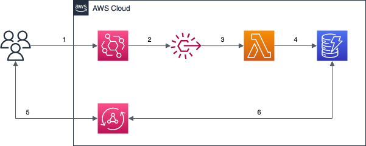

# Terragrunt and Terraspace comparison

The purpose of this repository is to compare the two leading Terraform supporting tools and see their strong and weak sides. 

The corresponding code is stored within `/terraspace` and `/terragrunt` directories within the repository. Those directories should be considered as they are a separate Git repositories that don't share anything with each other.

## Architecture of the infrastructure

The following diagram presents the AWS resources that are created by the code used by both Terragrunt and Terraspace.



### Flow description

1. Event is published to the custom Event Bus by users.
2. Rule is filtering events relevant for further processing.
3. Rule is forwarding relevant event to Lambda function.
4. Lambda function enriches and stores an event in DynamoDB.
5. Users interact with GraphQL API backed by AppSync to fetch data.
6. AppSync is integrated directly with DynamoDB using request/response templates.

## Tested versions of tools

### Terragrunt

- `terragrunt` version **v0.38.4**
- `go` version **go1.19.1**
- `terratest` version **v0.40.22**

### Terraspace

- `terraspace` version **2.2.2**
- `ruby` version **3.1.2p20**

## Working with the code

### Prerequisites

In order to create the infrastructure the AWS credentials have to be configured properly. Currently both version of the code expects `AWS_ACCESS_KEY`, `AWS_SECRET_ACCESS_KEY` and `AWS_REGION` environment variables are set to the values allowing to work with a given AWS account.

### Terragrunt

#### Infrastructure plan

For all stacks within an environment move to the `terragrunt/live/dev` and run the following command:

    terrgrunt run-all plan

To work with a single stack within an environment move to the `terragrunt/live/dev/<stack-name>` and run the following command:

    terragrunt plan

#### Infrastructure apply

For all stacks within an environment move to the `terragrunt/live/dev` and run the following command:
    
    terrgrunt run-all apply

To work with a single stack within an environment move to the `terragrunt/live/dev/<stack-name>` and run the following command:

    terragrunt apply

#### Infrastructure destroy

For all stacks within an environment move to the `terragrunt/live/dev` and run the following command:

    terrgrunt run-all destroy

To work with a single stack within an environment move to the `terragrunt/live/dev/<stack-name>` and run the following command:

    terragrunt destroy

### Terraspace

The most important thing to remember is to pass **TS_ENV** variable defining which environment
we would like to work with (`dev` used in all examples). 

#### Build phase

In order to download all 3rd party modules defined within `Terrafile` file and start working with the project
the following command has to be executed:

    terraspace build

#### Infrastructure plan

For all stacks for the particular environment move to `terraspace` directory and execute the following command:

    TS_ENV=dev terraspace all plan

To limit the `plan` to the single stack (e.g: backend) move to the `terraspace` directory and execute the following command:

    TS_ENV=dev terraspace plan backend

#### Infrastructure apply

For all stacks for the particular environment move to `terraspace` directory and execute the following command:

    TS_ENV=dev terraspace all up

To limit the `apply` to the single stack (e.g: backend) move to the `terraspace` directory and execute the following command:

    TS_ENV=dev terraspace up backend

#### Infrastructure destroy

For all stacks for the particular environment move to `terraspace` directory and execute the following command:

    TS_ENV=dev terraspace all down

To limit the `apply` to the single stack (e.g: backend) move to the `terraspace` directory and execute the following command:

    TS_ENV=dev terraspace down backend

## Running tests

### Terragrunt

In order to run Terratest based test suite enter a test directory and run the following command:

    go test -v

To limit test execution to a single test case use the following command:

    go test -v <test-file-name>

### Terraspace

To run a test for a module/stack/project one has to enter its directory and run the following command:

    bundle && terraspace test

## Tools comparison

### Subjective thoughts

#### Personal verdict

Personally Terragrunt seems to be my tool of choice when working with Terraform project at scale. It's just simpler,
it focuses on just making the work with Terraform more convenient, and it's not trying to be overblown with features (like
putting Ruby's templates into Terraform code). It requires some expertise from the end user (especially when it comes to project structure) but
seems to be focused on just a single task.

On the other hand Terraspace can be a good choice for beginners who lack experience when it comes to
working with enterprise graded project. It offers a strict structure of a project, convenient CLI and easy to work with code
generators. Unfortunately some design decisions are making work with it less comfortable when it comes to smarter IDEs 
(e.g: offering code auto-completion when it comes to attribute definition for third party modules).

#### Pros and cons

##### Terragrunt

| Pros                                                                                                                  | Cons                                                                          |
|-----------------------------------------------------------------------------------------------------------------------|-------------------------------------------------------------------------------|
| Fairly easy to understand and reason about                                                                            | Not heavily opinionated which can lead to far-from-optimal project structures |
| Convenient way of testing using nicely integrated 3rd party tool (with commonly used across DevOps world Go language) | Testing has to be added externally                                            |
| Just a wrapper, does one thing and does it right                                                                      | Some code duplication that can't be avoided (multiple environments)           |

##### Terraspace

| Pros                                                                          | Cons                                                       |
|-------------------------------------------------------------------------------|------------------------------------------------------------|
| Can be a nice entry point for people don't experienced with Terrafom on scale | 3rd party modules handling causing issues with IDEs        |
| Opinionated and with strictly defined project structure                       | No way to run multiple test cases at once                  |
| Highly extendable with extensions written in Ruby                             | Mixing Ruby's code with Terraform causing issues with IDEs |
| Convenient generators                                                         |                                                            |

### Comparison aspects

| Aspect                                                             | Terragrunt                                                                                              | Terraspace                                                                                                                                           |
|--------------------------------------------------------------------|---------------------------------------------------------------------------------------------------------|------------------------------------------------------------------------------------------------------------------------------------------------------|
| **Automated project creation (directories and backing resources)** | Available                                                                                               | Available                                                                                                                                            |
| **Project directories structure**                                  | Not enforced, there are some recommendations                                                            | Enforced by the tool itself                                                                                                                          |
| **Multiple environments handling**                                 | Multiple directories for different environments (each stack defined separately for a given environment) | Controlled by setting up the relevant environment variable and dedicated variables files; stacks definitions not duplicated for different environments |
| **Local/global variables handling**                                | Variables defined on different project levels and imported when needed                                  | Variables defined on either global or stack level, resolved using layering mechanism without explicit imports                                        |
| **Working with multiple stacks and handling dependencies**         | Dedicated blocks for dependencies definitions and mock possibilities                                    | Ruby expressions defining dependencies (e.g: outputs usage) with mocking possibilities                                                               | 
| **External/3rd party modules handling**                            | Regular Terraform `module` source syntax                                                                | Defined within `Terrafile` file, downloaded and used in the same way as local ones                                                                   |
| **Testing capabilities**                                           | Not built-in, Terratest as a recommendation for writing test cases                                      | Integrated testing capabilities basing on Ruby's RSpec                                                                                               |
| **Extensions and hooks**                                           | Available before/after Terraform commands                                                               | Multiple hooks on different levels and custom extensions basing on Ruby code                                                                         |
| **Debugging of generated Terraform code**                          | Possible by verifying `.terragrunt-cache` directory                                                     | Possible by verifying `.terraspace-cache` directory                                                                                                  |

### Detailed description

#### Automated project creation (project directories layout and state management backing resources)

##### Terragrunt

When the configured AWS credentials has enough permissions Terragrunt can use them
to automatically create both state S3 bucket and locks DynamoDB table. With the help of a
lot of built-in functions both S3 bucket name and DynamoDB lock table name can be customized.

```terraform
// terragrunt.hcl

remote_state {
  backend = "s3"
  generate = {
    path      = "backend.tf"
    if_exists = "overwrite"
  }
  config = {
    bucket         = "terraform-state-${get_aws_account_id()}"
    key            = "${path_relative_to_include()}/terraform.tfstate"
    region         = "us-east-1"
    encrypt        = true
    dynamodb_table = "terraform_locks"
  }
}
```

##### Terraspace

When the configured AWS credentials has enough permissions Terraspace can use them
to automatically create both state S3 bucket and locks DynamoDB table. With the help of a
rich set of built-in functions both S3 bucket name and DynamoDB lock table name can be customized.
Although all is defined within `*.tf` file, Ruby's templating syntax is used heavilly to expand 
available placeholders.

```terraform
terraform {
  backend "s3" {
    bucket         = "<%= expansion('terraform-state-:ACCOUNT-:REGION-:ENV') %>"
    key            = "<%= expansion(':PROJECT/:REGION/:APP/:ROLE/:ENV/:EXTRA/:BUILD_DIR/terraform.tfstate') %>"
    region         = "<%= expansion(':REGION') %>"
    encrypt        = true
    dynamodb_table = "terraform_locks"
  }
}
```

#### Project directories structure

##### Terragrunt

Terragrunt does not have any strict guidelines how the project structure should look like.
In a nutshell it's rather following the recommended Terraform guidelines but does not block user
from doing something completely customized. Terragrunt does not offer any code generators and 
all the layout and files structure have to be created manually by a developer.

As usual first layer of building blocks should be a set of **reusable modules** that are written in pure Terraform.
It's recommended to have them separated in a dedicated Git repository and keep them logic-less.
They should be versioned and released separately.

The next step is to use them to build **stacks**. Stack itself should be a structure with business meaning; 
couple of components used together to create a layer of a system. Like the modules they should be
versioned and released in a separate manner. They should be written in pure Terraform and kept in a separated
Git repository that can be later referenced from the Terragrunt.

The last layer with this setup is **live** repository. This is the level where Terragrunt can be used to ease
multiple environments and stacks management. The typical layout of the repository usually looks the following:

```
<repository-root>   
│ terragrunt.hcl
└───<environment-1-name>
│   │ env.hcl
│   └───<stack-1-name>
│   |    │ terragrunt.hcl
│   |    │ ... (other supporting files)
|   |
|   └───<stack-2-name>
│        │ terragrunt.hcl
│        │ ... (other supporting files)
│   
└───<environment-2-name>
    │   ...
```

All the directories in the same level as `*.hcl` files are considered as the ones containing Terraform code
unless they start with `_` (like `_env` where general stacks configuration is kept and `_test` keeping test suites for
complete environment setup).

##### Terraspace

Terraspace offers a convenient generators for scaffolding different aspects of the infrastructure project. It follows the same
granularity as the one recommended by Terragrunt (module/stack/project) but comes in with an opinionated directories 
structure that should be followed.

```
<repository-root>   
│ Gemfile
│ Terrafile
└───config
│   │ app.rb
│   └───terraform
│       │ backend.tf 
│       │ provider.tf 
│       │ ... (other configuration files)
│   
└───app
│   └───modules
|   |   └─── <module-1>
|   |   |     | ... (terraform files) 
|   |   └─── <module-2>
|   |   |     | ... (terraform files)  
│   └───stacks
|       └─── <stack-1>
|       |     | ... (terraform files)        
|       └─── <stack-2>
|             | ... (terraform files)
└───vendor
    └───modules
        └───<vendor-module-1>
        └───<vendor-module-2>     
```

The `config` directory is responsible for holding the project configuration. It's not only
holding Terraform related settings (backend, providers etc.) but also the Terraspace itself (`app.rb` file).

The next important directory is `app` where user defined modules and stacks are defined. As within Terragrunt modules
should be reusable and lack of business logic and stacks are more complex structures with business value (a collection
of stacks forms a project).

Last but not least there is generated `vendor/modules` directory where used 3rd party modules are 
downloaded for later use (these are defined within `Terrafile` file).

The source code that can be found in a Terraspace project is a mix of Terraform (`*.tf` and `*.tfvars` files) and 
Ruby's `*.rb` files (mostly configuration, custom extensions and tests).

#### Multiple environments handling

##### Terragrunt

Terragrunt expects multiple directories are created for different environments. In order to avoid duplication, 
configuration within recommended `_env` directory should contain all common aspect of the stacks used to create 
an environment (e.g: source of the stack, common variables etc.). This file can be included later on within 
`terragrunt.hcl` file of a particular stack deployed on a particular environment.

The following code snippets shows this mechanism in action:

```terraform
// _env/backend.hcl

locals {
  source_base_url = "${path_relative_from_include()}/../..//stacks//backend" # in real project this should be fetched from separated Git repository
}

terraform {
  source = local.source_base_url
}
```

```terraform
// dev/backend/terragrunt.hcl

include "root" {
  path = find_in_parent_folders()
}

include "env" {
  path   = "${get_terragrunt_dir()}/../../_env/backend.hcl"
  expose = true
}

locals {
  environment_vars = read_terragrunt_config(find_in_parent_folders("env.hcl"))
  environment_name = local.environment_vars.locals.environment
}
```

##### Terraspace

Terraspace does not require a developer to reflect different environments with the explicit directories
hosting each stack configuration. The way it manages desired environment selection is the `TS_ENV` variable
preceding each Terraspace command.

To customize a stack configuration `tfvars` directory should be used where a dedicated file with overwrites
exists (e.g: `dev.tfvars` for `dev` environment).

    TS_ENV=dev terraspace all plan

    TS_ENV=dev terraspace all up

```terraform
// app/stacks/backend/tfvars/dev.tfvars

environment="dev"
```

#### Local/global variables handling

##### Terragrunt

Terragrunt allows a developer to declare variables on the different levels of the directories structure
just to avoid code duplications. It might be sometimes problematic to find out inputs for the stack (because
different variables can be set on different level of directories hierarchy) but at the end of the day 
the offered mechanism is predictable and easy to get comfortable with.

Different `*.hcl` files can be imported using `include` function and specifying the path. With this approach
`inputs` will be propagated automatically; when it comes to `locals` propagation `expose` parameter
have to be explicitly set to make them visible.

```terraform
// terragrunt.hcl

inputs = {
  project_name = "terragrunt-upskilling"
}
```

```terraform
// _env/backend.hcl

locals {
  source_base_url = "${path_relative_from_include()}/../..//stacks//backend" # in real project this should be fetched from separated Git repository
}

terraform {
  source = local.source_base_url
}
```

```terraform
// dev/env.hcl

locals {
  environment = "dev"
}
```

```terraform
// dev/backend/terragrunt.hcl

include "root" {
  path = find_in_parent_folders()
}

include "env" {
  path   = "${get_terragrunt_dir()}/../../_env/backend.hcl"
  expose = true
}

locals {
  environment_vars = read_terragrunt_config(find_in_parent_folders("env.hcl"))
  environment_name = local.environment_vars.locals.environment
}

// ...

inputs = {
  environment = local.environment_name
  tags        = dependency.common-tags.outputs.tags
}
```

##### Terraspace

Terraspace bases on the `*.tfvars` files usage when it comes to variables definition. Global variables 
can be defined within `config/terraform/globals.auto.tfvars` (only file location is relevant, filename is not) and
all the others are defined within stacks `tfvars` variable.

Terraspace is using the concept of layering. The `tfvars/base.tfvars` are used across all environment 
for the stack. If there is a need environment dependant or overrides for the base ones can be added by defining them
within `tfvars/<env_name>.tfvars` file.

Besides regular literals a set of Ruby helpers functions and expandable templates might be used 
for values of variables. This gives a lot of flexibility when it comes to define global variables
which can change their values depending on environment without a need of duplicating code.

```terraform
// app/stacks/backend/tfvars/base.tfvars

instance_count=1
```

```terraform
// app/stacks/backend/tfvars/dev.tfvars

instance_count=2
```

```terraform
// config/terraform/globals.auto.tfvars

environment = "<%= Terraspace.env %>"
```

#### Working with multiple stacks and handling dependencies

##### Terragrunt

There is `run-all <action>` command responsible for performing execution against multiple stacks at once.

    terragrunt run-all plan

    terragrunt run-all apply

Dependencies across multiple stacks are declared using `dependency` or `dependencies` blocks within
stack's `terragrunt.hcl` file. The most important part of a dependency definition is the `config_path` attribute
where stack one depend on is defined. 

```terraform
// dev/backend/terragrunt.hcl

dependency "common-tags" {
  config_path = "../common-tags"

  mock_outputs_allowed_terraform_commands = ["validate", "plan"]
  mock_outputs = {
    tags = {}
  }
}
```

To mock outputs not available when the command is run (e.g: first plan execution) one can use combination of
`mock_outputs_allowed_terraform_commands` and `mock_outputs` blocks.

##### Terraspace

There is a set of convenient commands which allows a developer to interact with multiple stacks at once:

    TS_ENV=dev terraspace all plan

    TS_ENV=dev terraspace all up

    TS_ENV=dev terraspace all down

Dependencies across multiple stacks (on outputs level) can be defined using the Ruby's
templating (`common-tags` in the example below is the name of a different stack and `tags` is 
the name of one of the outputs):

```terraform
// app/stacks/backend/tfvars/base.tfvars

tags = <%= output('common-tags.tags', mock: {}) %>
```

To mock outputs not available when the command is run (e.g: first plan execution) one can use `mock` attribute in the
dependant output definition.

#### External/3rd party modules handling

##### Terragrunt

Terragrunt is using the same syntax as modules sources in pure Terraform. External modules are
downloaded to `.terragrunt_cache` directory to prevent unnecessary downloads.

##### Terraspace

Terraspace offers a mechanism allowing a developer to declare an external module usage within `Terrafile` file. Then such
modules can be downloaded (using `terraspace build` command) to the `vendor/modules` directory. With them in place
they can be put under projects version control (if that's the team's will) and used like any other locally defined 
modules. There is no distinguish between 3rd party and locally defined in the `app/modules` directory. What's more
all of them are referenced from the stack using the same `../../modules/<module_name>` paths (the framework handles on its
own whether they should be searched for within `app/modules` or `vendor/modules`). 

At the first glance this behavior
might be not intrusive, but it causes issues with code completion and IDE support (module paths are not referring to exact location
of the vendor modules therefore they're considered as missing and properties completion just don't work). On the other hand
having them downloaded locally means the team don't have to longer worry about their existence in public registries.

#### Testing capabilities

##### Terragrunt

Terragrunt itself does not offer any testing capabilities out-of-the-box. Nevertheless, it's a common use case
to include Terratest as the test framework and prepare the test suites. What is worth saying, Terratest
offers Terragrunt integration and is capable of running not only pure Terraform modules tests, but also handles usual scenario with
executing commands against multiple stacks at once.

Terratest requires test cases to be written in Go. With a convenient set of helper methods (not only responsible
for handling apply and destroy, but also performing basic AWS checks) it makes test scenarios easy to implement and 
reason about. Also, when AWS helper methods are not enough, nothing stops from using the full AWS SDK
or any other library to verify the code works as expected.

There is no clear recommendation whether test code should reside within each module/stack
directory or in a single `test` directory where scenarios for all modules/stacks are defined within
dedicated files.

Testing using Go and Terratest offers also a convenient way of running cases using a single command (executed from the test directory):

    go test -v [test_file_name.go]

```go
// modules/test/common_tags.go

package test

import (
	"testing"

	"github.com/gruntwork-io/terratest/modules/terraform"
	"github.com/stretchr/testify/assert"
)

func TestCommonTagsModule(t *testing.T) {
	terraformOptions := terraform.WithDefaultRetryableErrors(t, &terraform.Options{
		TerraformDir: "../common-tags",
		Vars: map[string]interface{}{
			"environment":  "test",
			"project_name": "test-project-name",
		},
	})

	defer terraform.Destroy(t, terraformOptions)
	terraform.InitAndApply(t, terraformOptions)

	outputTags := terraform.OutputMap(t, terraformOptions, "tags")
	expectedTags := map[string]string{
		"Environment":  "test",
		"ManagedBy":    "terraform",
		"Organisation": "NearForm",
		"Project":      "test-project-name",
	}
	assert.Equal(t, expectedTags, outputTags)
}
```

##### Terraspace

Terraspace offers built-in testing capabilities backed by Ruby's RSpec framework. It offers testing different layers of the project
(modules, stacks and custom helpers on project level) but unfortunately lacks of the ability of running multiple
tests suites at once. Test cases are written in Ruby and can be generated using convenient CLI tool. They're located within
the directory of a given module or stack which is a subject of a test.

The framework itself offers not many out-of-the-box helper functions (mostly to interact with the `terraspace` CLI tool;
not to assert on or verify the created resources). 

All needed dependencies or SDKs can be added on demand using standard `gem` mechanism which 
offers elasticity in terms of both verifications and interactions with created resources.

Terraspace offers a convenient way to pass variables or change the providers configuration by editing the generated files within
test's `fixtures/config` or `fixtures/tfvars` directories.

```ruby
# app/modules/common-tags/test/spec/main_spec.rb

describe "common-tags module" do
  before(:all) do
    mod_path = File.expand_path("../..", __dir__)
    terraspace.build_test_harness(
      name: "common-tags-harness",
      modules: {
        "common-tags": mod_path
      },
      tfvars: {
        "common-tags": "spec/fixtures/tfvars/test.tfvars"
      },
    )
    terraspace.up("common-tags")
  end
  after(:all) do
    terraspace.down("common-tags")
  end

  it "should return a list of common resources tags" do
    expect(terraspace.output("common-tags", "tags")).to eq({
        "Environment" => "test-environment",
        "ManagedBy" => "terraform",
        "Project" => "test-project",
        "Organisation" => "NearForm"
    })
  end
end

```

#### Extensions and hooks

##### Terragrunt

Terragrunt offers a hook mechanism that allows a developer to define actions performed before/after particular 
Terraform commands (`plan`, `apply` etc.). With a combination of helper functions giving information
about the stack we currently work with, integrations with 3rd party tools can be implemented in a convenient manner (
e.g: when `plan` is run locally and plan file is stored within a file, Infracost can be executed immediately to show 
how changes affect the bill). 

On the other side obtaining execution paths can be quite tricky because Terragrunt itself works 
within `.terragrunt-cache` directory which does not correspond to the project structure developer works with. 

```terraform
terraform {
  after_hook "Infracost analysis" {
    commands     = ["plan"]
    execute      = [
      "${get_repo_root()}/${get_path_from_repo_root()}/${path_relative_from_include()}/_scripts/analyze-costs.sh",
      "${get_repo_root()}/${get_path_from_repo_root()}"
    ]
    run_on_error = false
  }
}
```

##### Terraspace

Terraspace offers a rich set of hooks that can be used to customize the developer workflow. Besides being able to hook in
both Terraform and Terraspace commands, the framework offers a capability of developing completely custom hooks.

Besides hooks Terraspace offers a set of built-in Ruby's helpers that can be used within regular Terraform code.
These are evaluated and resolved by the framework while generating Terraform code. Besides the built-ins
there is an opportunity to develop such a function completely from the scratch which offers almost limitless
set of possibilities.

```ruby
# config/hooks/terraform.rb

before("init",
  execute: "echo hi",
)

after("apply",
  execute: "echo bye"
)
```

```terraform
user = "<%= aws_secret("demo-:ENV-user") %>"
```

#### Debugging of generated Terraform code

##### Terragrunt

All the generated and downloaded code by the Terragrunt can be found in the `.terragrunt-cache`
directory within a given module/stack/live stack instance. This might be useful when one needs to verify 
how pure Terraform code looks like.

##### Terraspace

All the generated and downloaded code by the Terraspace can be found in the `.terraspace-cache`
directory within a given module/stack/live stack instance. This might be useful when one needs to verify
how pure Terraform code looks like.
